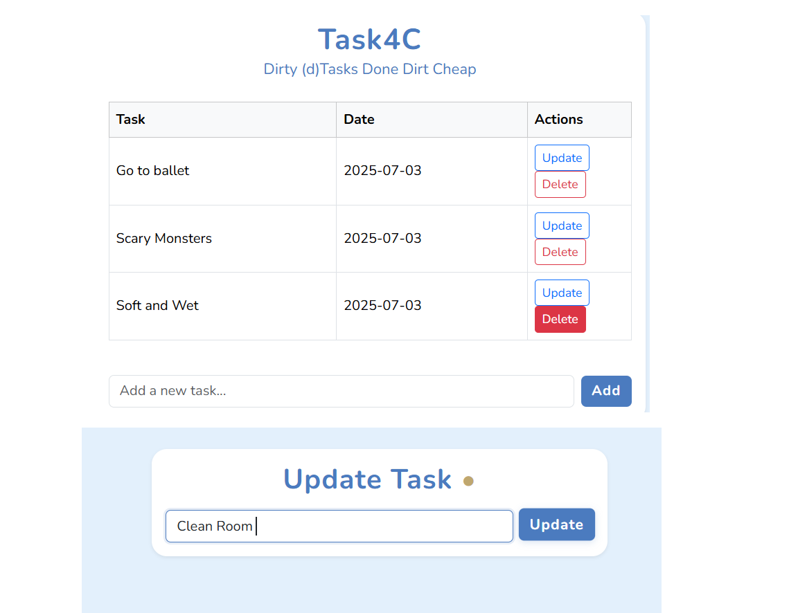

# Task4C

A modern, fun, and distraction-free task manager built with Flask.  
Inspired by D4C — here, your tasks stay organized.



---


## Features
- Add, update, and delete tasks
- Clean, responsive UI (Steel Ball Run inspired)
- Simple and easy to use

## Setup
1. **Clone the repository:**
   ```bash
   git clone https://github.com/safwansatil/task4c.git
   cd task4c
   ```
2. **Create a virtual environment (optional but recommended):**
   ```bash
   python -m venv env
   source env/bin/activate  # On Windows: env\Scripts\activate
   ```
3. **Install dependencies:**
   ```bash
   pip install flask
   ```
4. **Run the app:**
   ```bash
   flask run
   ```

## Folder Structure
- `app.py` — Main Flask application
- `templates/` — HTML templates
- `static/css/` — Custom styles
- `instance/test.db` — SQLite database (auto-created)

## Contact
- Email: asf1k.til@gmail.com
- GitHub: [safwansatil](https://github.com/safwansatil)

---

I'm open for discussion, collaboration, criticism, and any suggestions to make this project better. Feel free to reach out! 
